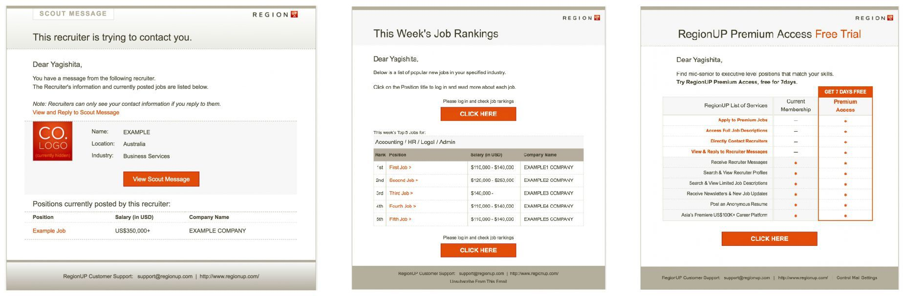
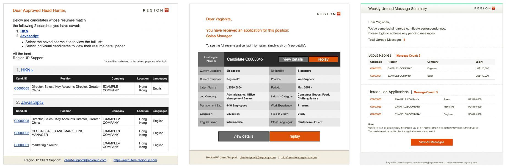
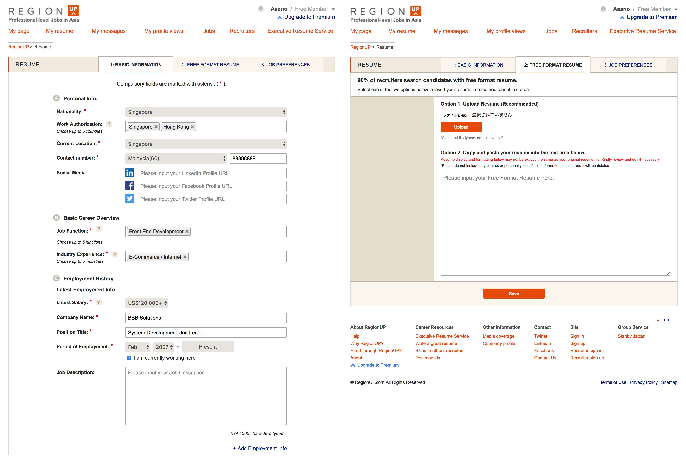
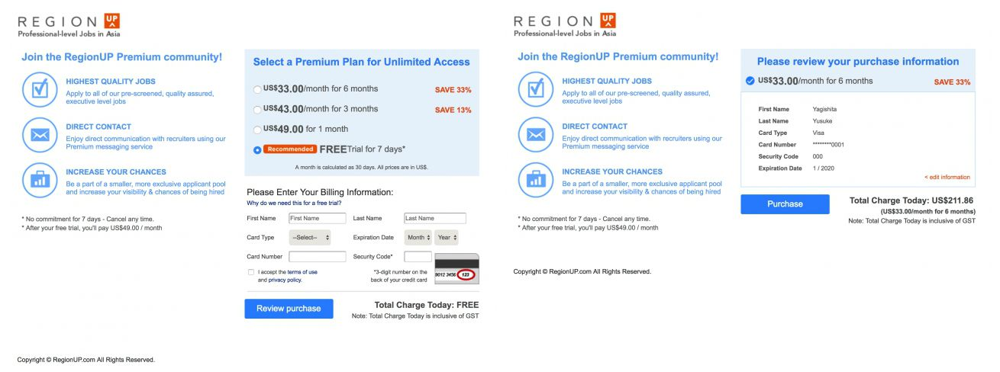
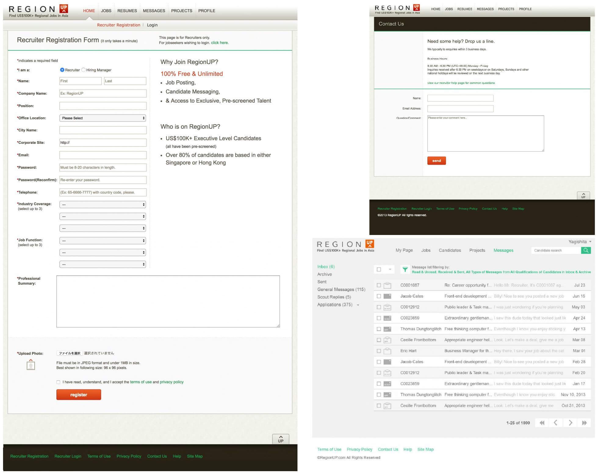

> <b>クライアント</b>: 株式会社ビズリーチ 
> <b>サービス</b>: RegionUP 
> <b>担当サービス</b>: <a href="https://www.regionup.com/" target="blank">求職者向けサービス</a> / <a href="https://recruiters.regionup.com/" target="blank">採用担当者向けサービス</a> / 社内管理サービス 
> <b>サービス概要</b>: エグゼクティブ向け転職サイト「ビズリーチ」のアジア全域を対象にした初の求職者課金型転職サイト.

<!--more-->

## Webエンジニア始動
エンジニア2名という事業立ち上げ期に、開発メンバーとしてJOIN.
HTMLのPタグも分からなかったヒヨっ子エンジニアの私が、
フロントエンドからバックエンドまで一気通貫して開発するまでに成長した.
使用技術と開発スタイルは以下のとおり.
ここでは、プロジェクトで担当した施策の一例を記載.

> <b>サーバーサイド</b>: Java(SAStruts / DBFlute / JSP / Velocity), MySQL 
> <b>フロントエンド</b>: JavaScript, jQuery, HTML, CSS 
> <b>リポジトリ</b>: Git 
> <b>CI</b>: Jenkins 
> <b>コミュニケーション</b>: Backlog, ChatWork, Skype 
> <b>開発スタイル</b>: アジャイル

## メッセージ配信の最適化
メッセージの開封率向上のため、送信日時・件名をABテストで継続的に見直していき、
テキストベースからHTMLベースのデザインに置き換えた.
メッセージ配信処理の作成、HTMLコーディング、ユーザーアクティビティの調査・分析を担当.

### 求職者向けメッセージの一例

### 採用担当者向けメッセージの一例

## コミュニケーション増加プロジェクト
求職者と採用担当者間のコミュニケーション増加というKPIの数値を追って、
「メッセージ受信ボックスのデザイン変更」や、「スカウトのメッセージ通知」等の開発を担当.
また、上記のKPIを達成するため、レジュメ編集画面と購入画面のデザイン変更をおこなった.
- 求職者のレジュメが登録されれば、採用担当者のスカウト数が増加する.
- 有料会員が多くなれば求人に応募できたり、スカウトに返信可能となる.

### レジュメ編集画面

<a href="https://regionup.com/resume/" target="blank">https://regionup.com/resume/</a>

### 購入画面

<a href="https://regionup.com/purchase/" target="blank">https://regionup.com/purchase/</a>

## 採用担当者向けサービスのデザインリニューアル
当初、採用担当者向けサービスはtable構成で運用されていた.
デザインに限界があり、運用コストも多大なためデザインリニューアルをおこなうことになった.
およそ20画面のjQueryの設計やHTML・CSSのコーディングを一手に引き受け、
2ヶ月でリリースをおこなった.一例を以下に掲載.

- 左: 登録画面(<a href="https://recruiters.regionup.com/agent/regist/" target="blank">https://recruiters.regionup.com/agent/regist/</a>)
- 右上: 問い合わせ画面(<a href="https://recruiters.regionup.com/agent/inquiry/" target="blank">https://recruiters.regionup.com/agent/inquiry/</a>)
- 右下: メッセージ画面
