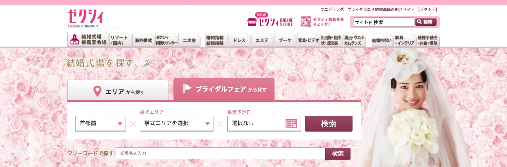
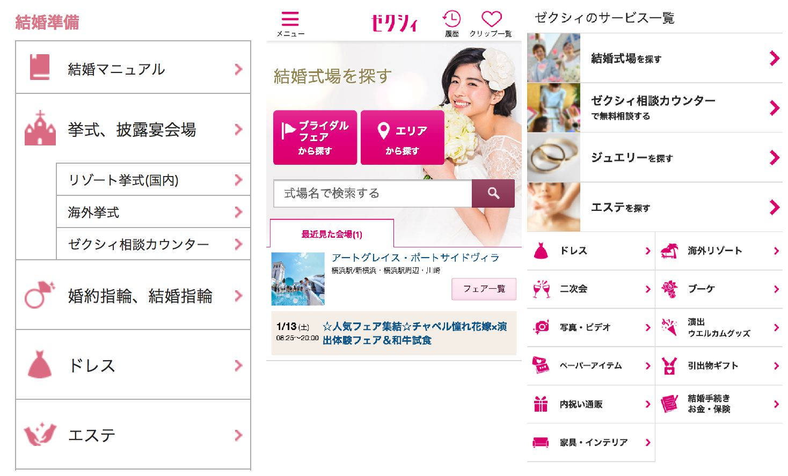
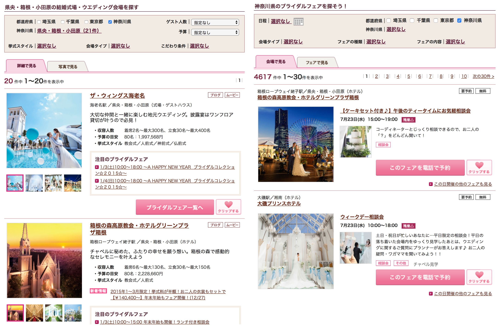
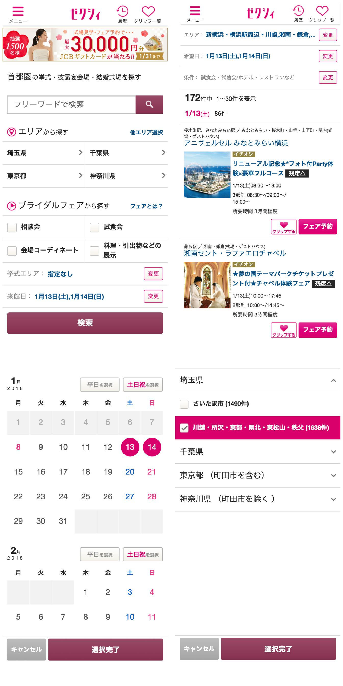
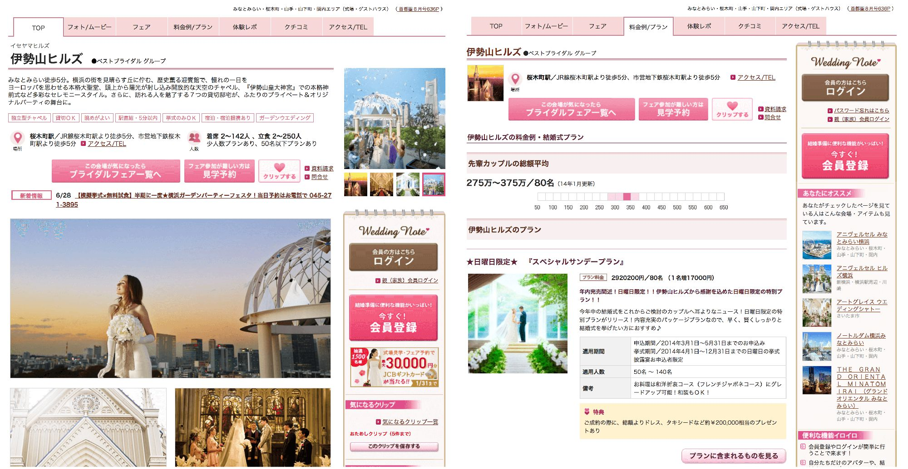

> <b>クライアント</b>: 株式会社リクルートマーケティングパートナーズ 
> <b>サービス</b>: ゼクシィnet 
> <b>担当サービス</b>: <a href="http://zexy.net/" target="blank">コンシューマ向けサービス</a> 
> <b>サービス概要</b>: 結婚情報誌「ゼクシィ」のWebサイト.国内外の式場やリング、ドレスといった結婚にまつわる情報を提供.

<!--more-->

## チームの立ち上げ
外注から内製化するフロントエンドチームの立ち上げにJOIN.
デザイナー2名・フロントエンド3名のサブリーダーとして活躍.
FTPからGitで資材管理をおこなったり、
毎回本番のソースをダウンロードするのではなく、
タスクランナーを入れてテンプレート化してエンハンスしていくなど、
開発だけでなく、働き方改革の推進もおこなった.
ここでは、プロジェクトで担当した施策の一例を記載.

> <b>フロントエンド</b>: JavaScript, jQuery, HTML, CSS, Grunt, LESS, Handlebars 
> <b>リポジトリ</b>: Git 
> <b>CI</b>: Jenkins 
> <b>コミュニケーション</b>: GitLab, ChatWork 
> <b>開発スタイル</b>: ウォーターフォール

## トップ画面のデザイン刷新
### PCサイト
### SPサイト

http://zexy.net/

http://zexy.net/

## 検索導線のデザイン刷新
### PCサイト

http://zexy.net/wedding/kanagawa/clientList/
http://zexy.net/wedding/kanagawa/fairClientList/

### SPサイト

http://zexy.net/wedding/shutoken/
http://zexy.net/wedding/kanagawa/clientList/
http://zexy.net/wedding/kanagawa/fairClientList/

## 式場画面のデザイン刷新
### PCサイト

http://zexy.net/wedding/c_7770027788/
http://zexy.net/wedding/c_7770027788/plan/

### SPサイト

http://zexy.net/wedding/c_7770027788/
http://zexy.net/wedding/c_7770027788/plan/
