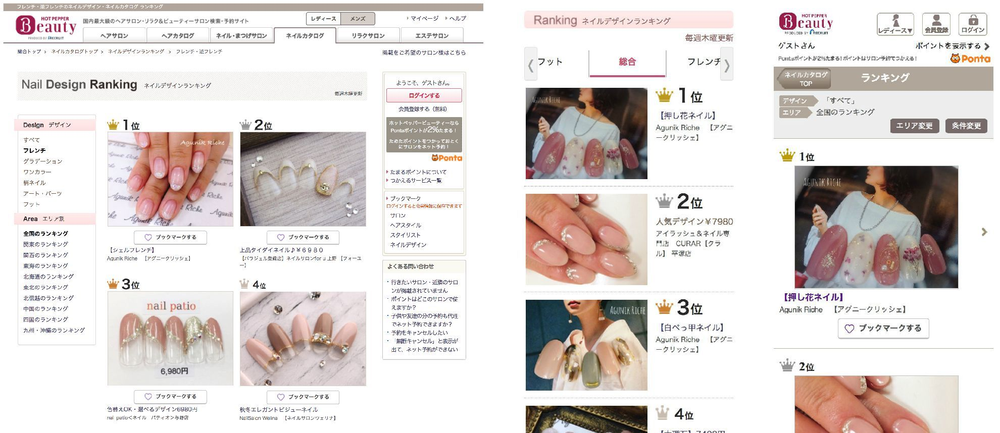
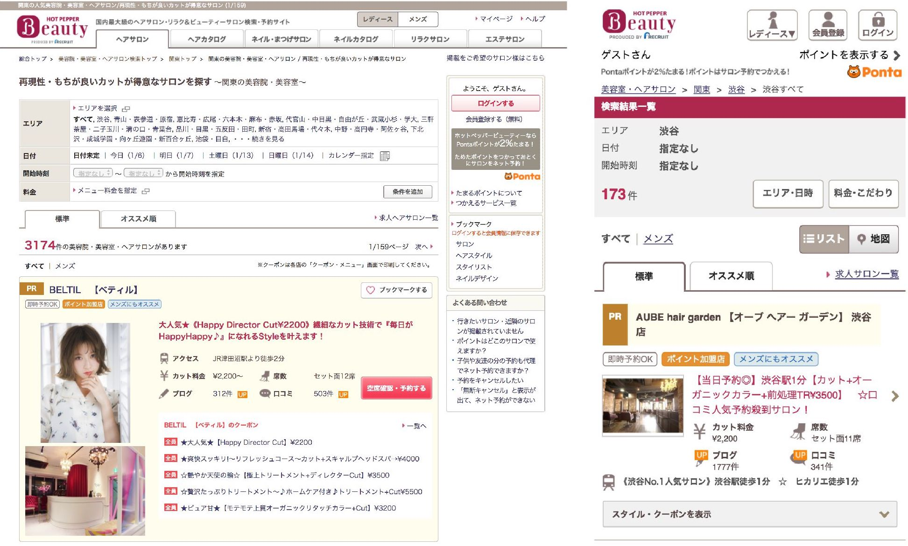
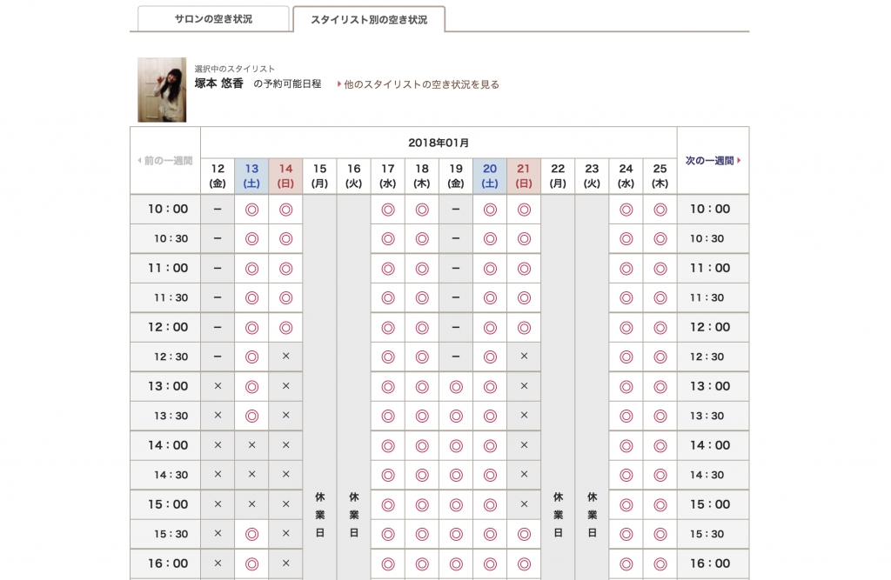

> <b>クライアント</b>: 株式会社リクルートライフスタイル 
> <b>サービス</b>: ホットペッパービューティー 
> <b>担当サービス</b>: <a href="https://beauty.hotpepper.jp/" target="blank">コンシューマ向けサービス</a> 
> <b>サービス概要</b>: 国内最大級のヘアサロン、リラク＆ビューティーサロンの検索・予約サイト.

<!--more-->

## 巨大システムで優秀賞
25名ほどのバックエンドチームのエンジニアとして参画.
サービスの根幹に関わる複雑なシステムの要件定義・設計・実装・テストを担当.

> <b>サーバーサイド</b>: Java(SAStruts / S2JDBC / JSP), Oracle, Solr 
> <b>フロントエンド</b>: JavaScript, jQuery, HTML, CSS 
> <b>リポジトリ</b>: SVN, Git 
> <b>CI</b>: Jenkins 
> <b>コミュニケーション</b>: GitHub, JIRA, Confluence, HipChat, Slack 
> <b>開発スタイル</b>: ウォーターフォール

### ネイルカタログの新規画面実装

### サービスリニューアルに伴う検索導線の改修

### サロンの在庫管理機能の機能拡張

### その他
ほげほげ
