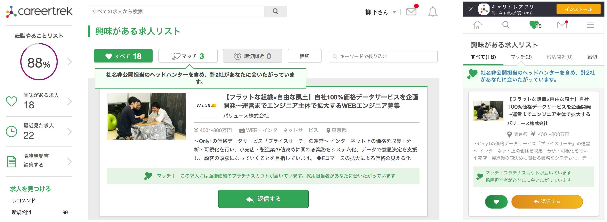
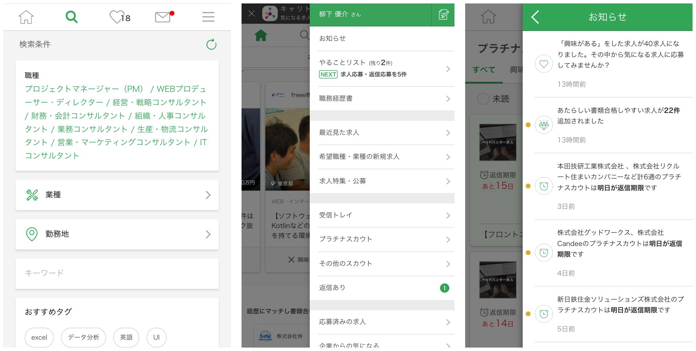

> <b>クライアント</b>: 株式会社ビズリーチ 
> <b>サービス</b>: キャリアトレック 
> <b>担当サービス</b>: <a href="https://www.careertrek.com" target="blank">求職者向けサービス</a> / 社内管理サービス 
> <b>サービス概要</b>: キャリアを考えはじめた20代のための、レコメンド型転職サイト.

<!--more-->

## バックエンド x フロントエンド
8名のスクラム体制のチームにバックエンドとフロントエンドのエンジニアとして参画.
手動で送っていたニュースレターを自動化したり、
若いチームだったのでテストケースの書き方や案件フローの見直し、
スタイルガイドの作成など幅広く担当した.

> <b>サーバーサイド</b>: Java(SAStruts / S2JDBC / JSP), MySQL 
> <b>フロントエンド</b>: JavaScript, jQuery, HTML, CSS 
> <b>リポジトリ</b>: Git 
> <b>CI</b>: Jenkins 
> <b>コミュニケーション</b>: GitHub, JIRA, Confluence, ChatWork, Slack 
> <b>開発スタイル</b>: アジャイル

## 興味がある求人画面の最適化
担当した一部の案件を紹介していく.
興味がある求人画面の絞り込み機能の追加案件では、
Redisの設計やAPIの作成、
フロントエンドの開発など一貫して実装を担当することで、
案件起案から1週間でリリースまでおこなった.

- お気に入り求人画面(<a href="https://www.careertrek.com/mypage/follow/" target="blank">https://www.careertrek.com/mypage/follow/</a>)

### グローバルナビゲーション
SPサイトのグローバルナビゲーションとサイドナビゲーションの改修をおこなった.

- SPのグローバルナビゲーション(<a href="https://www.careertrek.com/mypage/" target="blank">https://www.careertrek.com/mypage/</a>)
