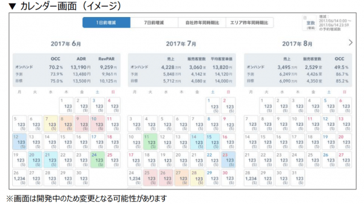

> <b>クライアント</b>: 株式会社リクルートライフスタイル 
> <b>サービス</b>: 旅行業務支援サービス ※2018年春頃リリース予定 
> <b>担当サービス</b>: 共通機能・トリップAIコンシェルジュ・レベニューアシスタントといった宿運営者向けサービス 
> <b>サービス概要</b>:
> 共通機能は、ログインや申し込み機能といった旅行業務支援サービスの共通機能を提供.
> トリップAIコンシェルジュは、AIを活用した問い合わせ対応の自動化サービスを提供.
> レベニューアシスタントは、需要を予測して宿泊料金設定の支援をおこなう.

<!--more-->

## さまざまなスキルセットの人が挑戦できる場に
フロントエンドエンジニア5名のリーダーとして、上記3サービスの要件定義や設計・実装をリード.
SPAでのシステム構成、CSS-in-JSや自動テストの導入など、クライアントにとっては新しい取り組みをおこなった.

> <b>フロントエンド</b>: JavaScript, React/Redux, jQuery, HTML, CSS, Gulp, EJS, Sass 
> <b>リポジトリ</b>: Git 
> <b>CI</b>: Jenkins 
> <b>コミュニケーション</b>: GitHub, JIRA, Confluence, Slack 
> <b>開発スタイル</b>: ウォーターフォール

## 共通機能
http://kawashimablog.com/yufuin/?p=19579

## トリップAIコンシェルジュ
http://hmd.geo.jp/ota/japan/jalan

## レベニューアシスタント
http://kawashimablog.com/yufuin/?p=19579

